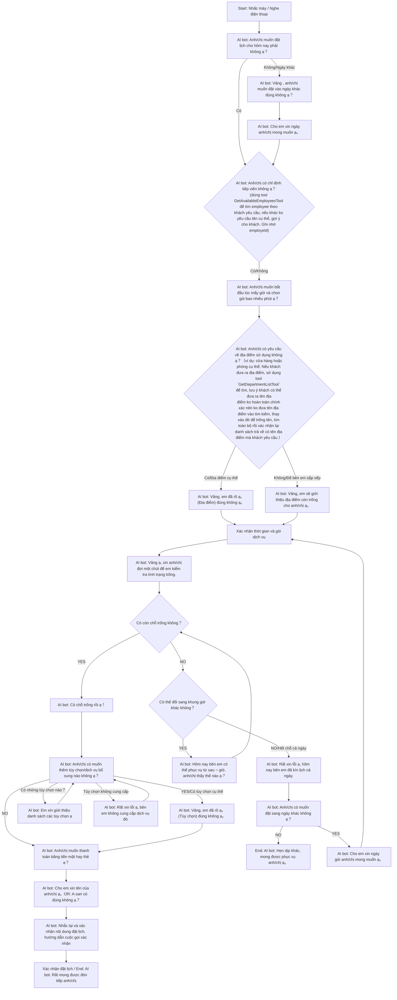

# Giải thích luồng Call Bot Center

Tài liệu này mô tả luồng hội thoại của Call Bot Center dựa trên sơ đồ logic đã cung cấp. Hệ thống xử lý cuộc gọi đến để đặt lịch dịch vụ, quản lý lựa chọn nhân viên/địa điểm, kiểm tra tình trạng trống, các tùy chọn bổ sung, chọn phương thức thanh toán và xác nhận đặt lịch.

## Tổng quan

Bot dẫn dắt người dùng theo luồng có nhiều nhánh và vòng lặp rõ ràng:
1.  **Nhận biết ý định**: Xác định khách đặt lịch cho hôm nay hay ngày khác.
2.  **Thu thập yêu cầu**: Ghi nhận chọn nhân viên, thời gian, thời lượng gói và địa điểm.
3.  **Xác nhận thời gian/gói**: Chốt lại thông tin thời gian và gói trước khi kiểm tra.
4.  **Kiểm tra tình trạng trống**: Xác minh tài nguyên (phòng/nhân viên).
5.  **Tùy chọn & thanh toán**: Hỏi về dịch vụ/tùy chọn bổ sung và phương thức thanh toán (có vòng lặp).
6.  **Kết thúc đặt lịch**: Xác nhận thông tin và kết thúc, hoặc xử lý trường hợp không còn chỗ với phương án thay thế (có vòng lặp).

## Các bước luồng chi tiết

### 1. Mở đầu & chọn ngày
*   **Bắt đầu**: Bot nhấc máy, chào khách.
*   **Hỏi ngày**: Bot hỏi ngay khách có muốn đặt lịch **hôm nay** không.
    *   **Có**: Tiếp tục thu thập các lựa chọn chi tiết.
    *   **Không / Ngày khác**: Ghi nhận yêu cầu ngày khác, hỏi **ngày/giờ** mong muốn, sau đó **quay lại** nhánh hỏi nhân viên (I → D) rồi tiếp tục (thời gian/gói → địa điểm).

### 2. Thu thập lựa chọn (hôm nay hoặc ngày khác)
Sau khi xác định ý định về ngày, bot thu thập các lựa chọn sau:

1.  **Chọn nhân viên**: Hỏi khách có muốn chỉ định nhân viên cụ thể không (sơ đồ có nhắc “nhân viên nữ”); dùng `GetAvailableEmployeesTool` để khớp yêu cầu và lưu `employeeId`.
2.  **Thời gian & gói dịch vụ**: Dù có chỉ định nhân viên hay không, bot đều hỏi:
    *   Thời gian bắt đầu.
    *   Thời lượng gói dịch vụ (phút).
3.  **Chọn địa điểm**: Hỏi khách có yêu cầu về địa điểm (chi nhánh/phòng) không.
    *   **Có yêu cầu cụ thể**: Bot xác nhận lại địa điểm; dùng `GetDepartmentListTool` để liệt kê/xác thực khi tên địa điểm chưa rõ.
    *   **Không có yêu cầu**: Bot xác nhận sẽ gợi ý địa điểm còn trống phù hợp.
4.  **Xác nhận thời gian & gói**: Sau khi có địa điểm (có/không), bot **xác nhận lại** thời gian và gói dịch vụ (nút J) trước khi kiểm tra.

### 3. Kiểm tra tình trạng trống
Tất cả nhánh đều hội tụ vào bước **kiểm tra hệ thống**:
1.  **Xử lý**: Bot kiểm tra lịch dựa trên thời gian, gói dịch vụ, và tình trạng trống của địa điểm/nhân viên.
2.  **Thông báo chờ**: Bot đề nghị khách đợi trong lúc kiểm tra **phòng còn trống**.

### 4. Các kịch bản xử lý

Sau khi kiểm tra, luồng rẽ nhánh theo kết quả:

#### Kịch bản A: Còn chỗ
Nếu còn phòng/khung giờ trống:
1.  **Tùy chọn bổ sung**: Bot hỏi khách có muốn thêm tùy chọn/dịch vụ bổ sung không.
    *   **Có tùy chọn cụ thể**: Bot xác nhận lại tùy chọn (S → S2).
    *   **Hỏi “Có những tùy chọn nào?”**: Bot giới thiệu danh sách rồi **quay lại hỏi** (S → S3 → S).
    *   **Tùy chọn không có**: Bot xin lỗi rồi **quay lại hỏi** (S → F2 → S).
2.  **Phương thức thanh toán**: Bot hỏi khách muốn trả tiền mặt hay thẻ.
3.  **Thu thập thông tin**: Bot xin **tên** khách hàng.
4.  **Xác nhận**: Bot nhắc lại thông tin đặt lịch và hướng dẫn cuộc gọi xác nhận.
5.  **Kết thúc**: Đặt lịch thành công và kết thúc cuộc gọi lịch sự.

#### Kịch bản B: Hết chỗ
Nếu khung giờ yêu cầu không còn chỗ, bot tìm phương án thay thế:

*   **Có khung giờ khác**:
    *   Bot đề xuất thời gian mới (ví dụ: “có thể phục vụ từ sau XX:XX”).
    *   **Vòng lặp**: Nếu khách cân nhắc/đồng ý, luồng quay lại **kiểm tra tình trạng trống** với thời gian mới (N → Kp).
*   **Hết chỗ cả ngày**:
    *   Bot xin lỗi và thông báo lịch đã kín cả ngày.
    *   **Chuyển hướng**: Hỏi khách có muốn đặt sang ngày khác không.
        *   **Có**: Xin ngày/giờ mới, sau đó đi thẳng tới bước **xác nhận thời gian/gói** rồi kiểm tra (I2 → J → Jp).
        *   **Không**: Kết thúc cuộc gọi lịch sự.

## Tham chiếu sơ đồ luồng

Luồng logic ở mức cao như sau:

