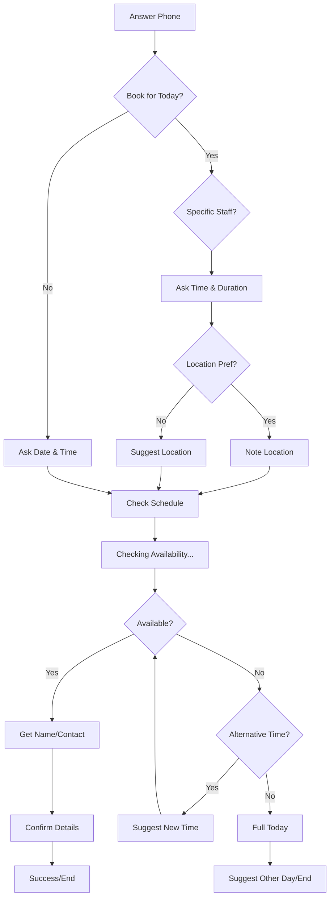

# Call Bot Center Flow Explanation

This document outlines the conversational flow for the Call Bot Center, based on the provided logic graph. The system handles incoming calls for service bookings, managing availability checks, user preferences, and confirmation scenarios.

## Overview

The bot guides the user through a linear process:
1.  **Intent Recognition**: Determining if the booking is for today or a future date.
2.  **Requirement Gathering**: Collecting details on staff, time, duration, and location.
3.  **Availability Check**: Verifying system resources (rooms/employees).
4.  **Booking Resolution**: Either confirming the booking or handling unavailability with suggestions.

## Detailed Flow Steps

### 1. Initial Contact & Date Selection
*   **Start**: The bot answers the incoming call.
*   **Date Query**: The bot immediately asks if the customer wants to book a session for **today**.
    *   **Yes**: Proceeds to the "Today" flow (detailed preferences).
    *   **No / Other Day**: Acknowledges the request for a different date and asks for the specific **date and time** desired. This path merges directly into the Availability Check.

### 2. "Today" Flow - Detailed Preferences
If the customer wants to book for today, the bot gathers specific details:

1.  **Staff Preference**: Asks if the customer wants to select a specific employee (specifically mentions "female employee" in the graph context).
2.  **Time & Service**: Regardless of staff choice, the bot asks for:
    *   Start time.
    *   Service package duration (in minutes).
3.  **Location Preference**: Asks if there is a specific preference for the location (branch or specific room).
    *   **Specific Request**: Bot notes the requested location.
    *   **No Preference**: Bot confirms it will suggest a suitable location.

### 3. Availability Check
All paths (Today's specific flow and Other Day's general flow) converge at the **System Check** phase:
1.  **Processing**: The bot verifies the requested time and service package against the schedule.
2.  **Wait Message**: The user is asked to wait while the system checks for **room availability**.

### 4. Resolution Scenarios

After checking availability, the flow branches based on the result:

#### Scenario A: Slot Available
If a room/slot is available:
1.  **Information Collection**: Bot informs the customer the slot is open and requests **Name** and **Contact Information**.
2.  **Confirmation**: Bot repeats the booking details to confirm accuracy and explains the validation process.
3.  **Success**: Booking is finalized, and the call ends with a polite closing.

#### Scenario B: Slot Not Available
If the requested slot is unavailable, the bot checks internally for alternatives:

*   **Alternative Exists**:
    *   The bot proposes a new time (e.g., "We have slots available after XX:XX").
    *   **Loop**: If the customer accepts/considers, the flow loops back to the **Availability Check** to verify the new specific time.
*   **No Alternatives (Full)**:
    *   Bot apologizes and informs the customer that the schedule is completely full for the day.
    *   **Pivot**: Asks if the customer would like to book for a different day instead, then ends the current flow.

## Flow Diagram Reference

The logic follows this high-level structure:

